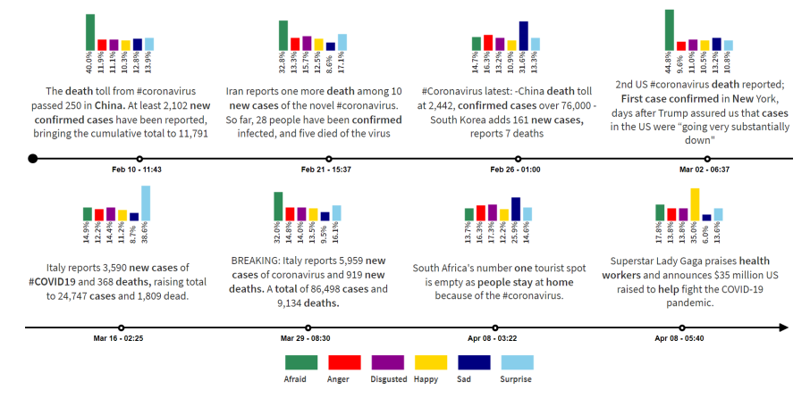
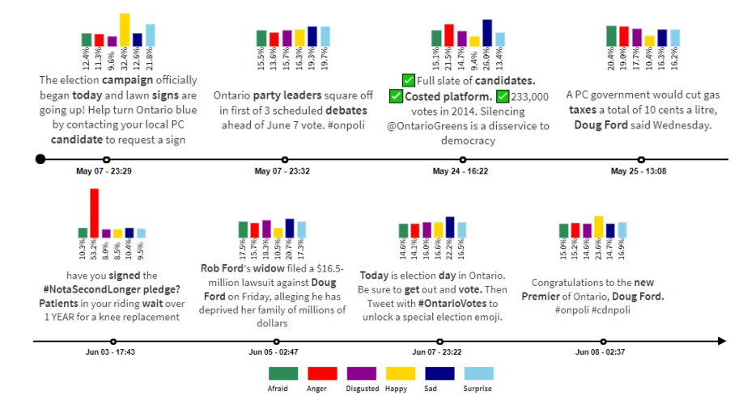

## MOSAIC : Emotion-Aware Event Summarization in Microblogs
This code contains the implementation of the project, MOSAIC that generates an emotion-aware event summary from microblogs related to an event. Check the following links for more details.

Conference Paper: This work has been presented at SocialNLP 2021 which held in conjuction with TheWebConf 2021. Please refer to the following link for the full paper.
https://dl.acm.org/doi/10.1145/3442442.3452311

Thesis: This work has been done as a Master Thesis in School of Computing, National University of Singapore. Please refer to the following link for the thesis.
https://scholarbank.nus.edu.sg/handle/10635/188077

### What is MOSAIC?
MOSAIC is an event analysis framework that comprises of three stages,
1. **A trend interval detection algorithm** to determine the granularity over the event timeline for discovering the hot topics while minimizing potential information loss
2. **A weakly supervised learning approach** to learn coherent topics and their corresponding emotional reactions in each trend interval
3. **An event summary generator** that gives representative microblogs and emotion distributions associated with the topics over time

To the best of our knowledge, there has been no attempt to generate event summary that includes both topics and their associated users’ emotional reactions.

### What can MOSAIC do?
Following figure shows an example of the summary generated using MOSAIC on 3M tweets collected over a period of 60 days during the COVID-19 outbreak.

Following figure shows another example of the factual summarization, and the corresponding users’ reaction, on the various issues that have surfaced during the
2018 Ontario election.

### Using MOSAIC
##### Required packages
* tweepy
* nltk
* pandas
* numpy
* sklearn
* emoji
* twikenizer
* gensim

##### Collect tweets
* Update twitter API credentials and file location to tweetId in DataCollectionScripts/twitter.py
* Run DataCollectionScripts/twitter.py to collect the tweets
* This script saves the necessary information required to run the project as a csv file and also saves the tweet objects as json which is not required to run the project

##### Evaluation Metrics
* Evaluation metrics can be found at src/evaluation/metrics
* All the metrics scripts accept list of src/evaluation/Data objects each representing an interval with information learnt by the models e.g. word dis, emotion dis etc.
* coherence.py computes the average PMI of top 5,10, and 20 words of given topics learned
* KLDivergence.py computes the average KL-Divergence of the emotion distributions of all the topics learned
* rougeScore.py computes rouge value for given reference summary and model summary

##### Running evaluation scripts
* update config.json
* run src/evaluation/PMISensitivityAnalysis.py to get PMI value of top 5 words for all the models for range of topics
* run src/evaluation/TrendIntervalDetection.py to compute to average intervals for range of alpha
* run src/evaluation/KLDivergence.py to compute KL-Divergence of emotion distribution of all the models
* run src/evaluation/RougeEvaluation.py to compute average rouge value against three reference summaries for all the models
