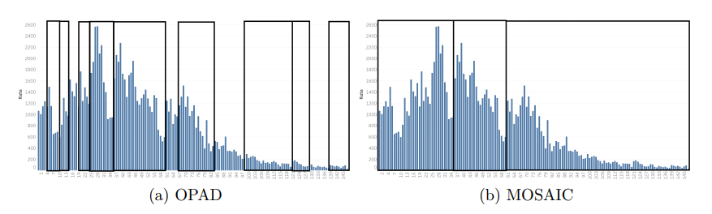

# MOSAIC : Emotion-Aware Event Summarization in Microblogs
This repository contains the implementation of the project, MOSAIC which generates an emotion-aware event summary from microblogs related to an event. Check the following links for more details.

[**Conference Paper**](https://dl.acm.org/doi/10.1145/3442442.3452311): This work has been presented at SocialNLP 2021 which held in conjuction with TheWebConf 2021 and published in the Companion Proceedings of the Web Conference 2021.

[**Master Thesis**](https://scholarbank.nus.edu.sg/handle/10635/188077): This work has been done as a Master Thesis in School of Computing, National University of Singapore. 

Please cite the paper or thesis if you use our implementation or resources.

### What is MOSAIC?
MOSAIC is an event analysis framework that comprises of three stages,
1. **A trend interval detection algorithm** to determine the granularity over the event timeline for discovering the hot topics while minimizing potential information loss
2. **A weakly supervised learning approach** to learn coherent topics and their corresponding emotional reactions in each trend interval
3. **An event summary generator** that gives representative microblogs and emotion distributions associated with the topics over time

To the best of our knowledge, there has been no attempt to generate event summary that includes both topics and their associated users’ emotional reactions.

### What can MOSAIC do?
#### 1. Generate Event Summary
Given a collection of tweets and small [emotional seed](Resources) that contains word to emotion mapping, our framework generates an event summary over time by summarizing each hot topic discussed with a representative tweet and emotional reaction as a probability distribution over predefined set of emotions.

Following figure shows an example of the summary generated using MOSAIC on 3M tweets collected over a period of 60 days during the COVID-19 outbreak.

Following figure shows another example of the factual summarization, and the corresponding users’ reaction, on the various issues that have surfaced during the
2018 Ontario election.

#### 2. Learn Topics and Emotions
Given a collection of tweets and small [emotional seed](Resources) that contains word to emotion mapping, out topic-emotion model [ETM](src/TopicModels/MOSAIC.py) can learn coherent topics and their corresponding emotional reaction. Especially, we propose a weakly supervised topic-emotion model that takes into consideration words conveying factual information about a topic, and words expressing the emotions of the users. Please refer to the [paper](https://dl.acm.org/doi/10.1145/3442442.3452311) or [thesis](https://scholarbank.nus.edu.sg/handle/10635/188077) for further reading.

#### 3. Detect Trend Intervals
Temporal peaks in microblogs is a good indicator of the emergence of hot topics. Out proposed [trend interval detection]() algorithm can partition
the life span of an event into a set of time intervals such that each time interval contains some trending topics. The algorithm uses a weighted moving
mean and variance to locate surges in the microblogs collection. Please refer to the [paper](https://dl.acm.org/doi/10.1145/3442442.3452311) or [thesis](https://scholarbank.nus.edu.sg/handle/10635/188077) for further reading. Following figure shows the trend intervals identified by trend intervals identified by MOSAIC versus OPAD on the Typhoon Hagupit dataset.

### Using MOSAIC

##### Resources
1. [Emotional Seed Words](Resources/)
2. Tweets - Please email the [author](mailto:rrubaa.p@sliit.lk)
3. Ground Truth Summary and Emotion - Please email the [author](mailto:rrubaa.p@sliit.lk)

##### Required packages
* tweepy
* nltk
* pandas
* numpy
* sklearn
* emoji
* twikenizer
* gensim

##### Collect Tweets
* Update twitter API credentials and file location to tweetId in DataCollectionScripts/twitter.py
* Run [DataCollectionScripts/twitter.py](DataCollectionScripts/twitter.py) to collect the tweets
* This script saves the necessary information required to run the project as a csv file and also saves the tweet objects as json which is not required to run the project

##### Framework Implementation
* [trendIntervalDetection.py](src/components/trendIntervalDetection.py) contains the implementation of MOSAIC's trend interval detection algorithm and the existing trend interval detection algorithm OPAD 
* [topicModels/MOSAIC.py](src/TopicModels/MOSAIC.py) contains the implementation of the proposed topic-emotion model ETM
* [topicModels/baseT](src/TopicModels/baseT) and [topicModels/baseE](src/TopicModels/baseE) contains the implementation of the existing topic models and topic-sentiment models respectively
* Given a topic model, our [contentSelection.py](src/components/contentSelection.py) generates the event summary over time by presenting a representative tweet per topic along with the emotional reaction

##### Evaluation Metrics
* Evaluation metrics can be found at [metrics](src/evaluation/metrics) folders
* All the metrics scripts accept list of [Data](src/evaluation/Data.py) objects each representing an interval with information learnt by the models e.g. word dis, emotion dis etc.
* [coherence.py](src/evaluation/metrics/coherence.py) computes the average PMI of top 5,10, and 20 words of given topics learned
* [KLDivergence.py](src/evaluation/metrics/KLDivergence.py) computes the average KL-Divergence of the emotion distributions of all the topics learned
* [rougeScore.py](src/evaluation/metrics/rougeScore.py) computes rouge value for given reference summary and model summary

##### Running evaluation scripts
* update [configuration](config.json) file
* run [PMISensitivityAnalysis.py](src/evaluation/PMISensitivityAnalysis.py) to get PMI value of top 5 words for all the models for range of topics
* run [TrendIntervalDetection.py](src/evaluation/TrendIntervalDetection.py) to compute to average intervals for range of alpha
* run [EvaluateKLDivergence.py](src/evaluation/EvaluateKLDivergence.py) to compute KL-Divergence of emotion distribution of all the models
* run [RougeEvaluation.py](src/evaluation/RougeEvaluation.py) to compute average rouge value against three reference summaries for all the models
